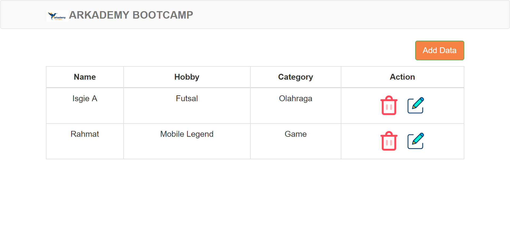
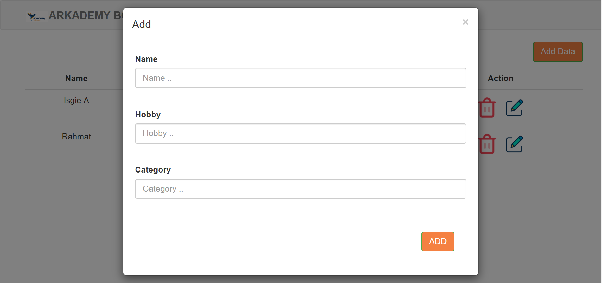
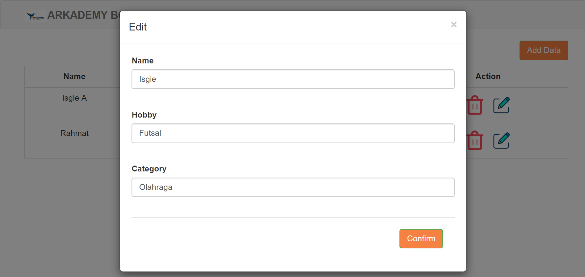

# Jawaban Bootcamp Arkademy
Untuk soal no.1 menggunakan javascript. Bisa dijalankan di https://es6console.com

Soal no.2-6 menggunakan java. Bisa dijalankan di https://www.onlinegdb.com/

Untuk soal no 7 :
 - menggunakan PHP native
 - menggunakan XAMPP dan Notepad++
 - database MySQL
 - dijalankan dengan mengakses index.php
 - screenshoot:

